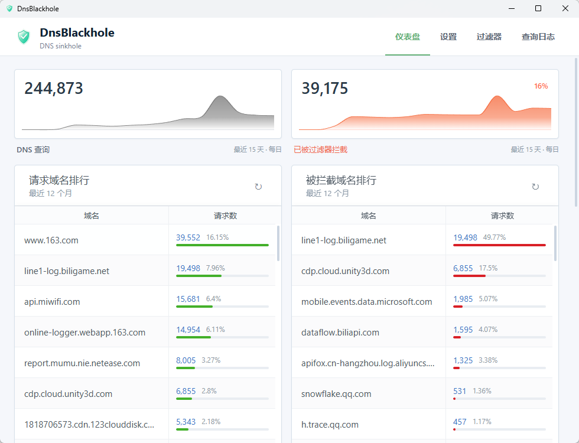
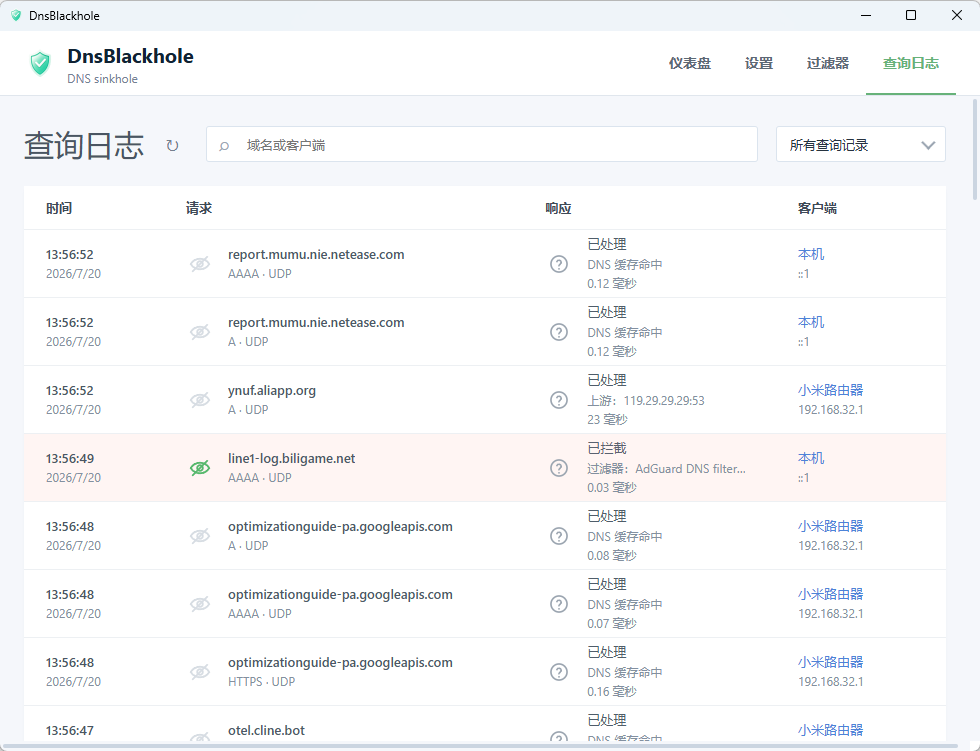
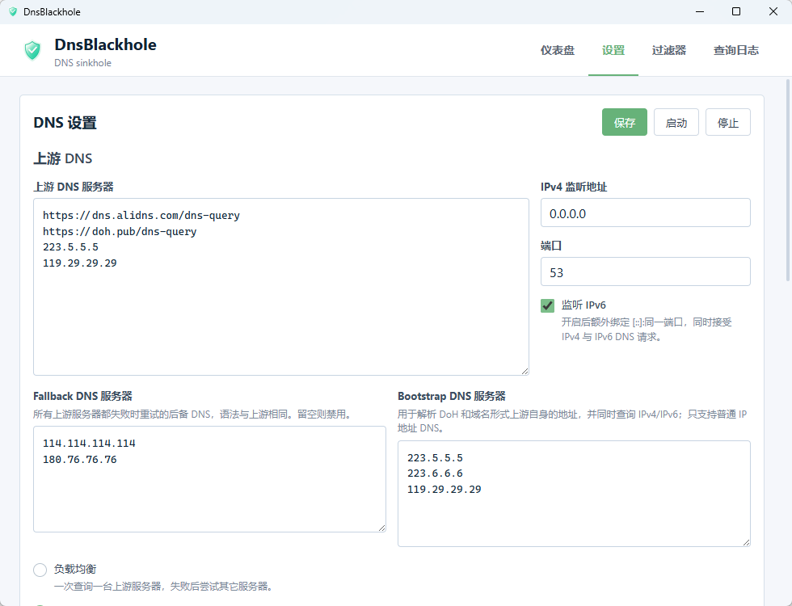
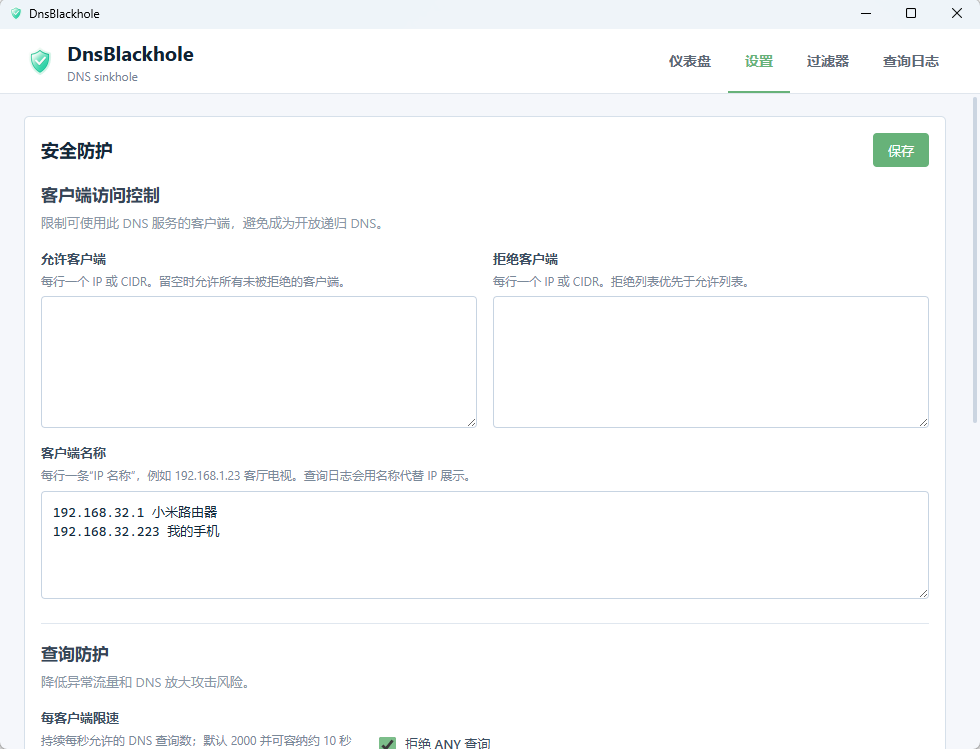
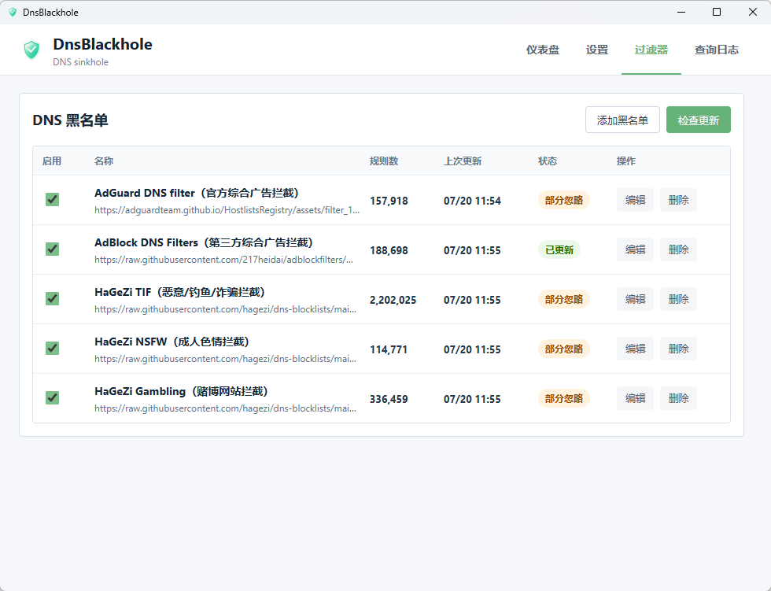
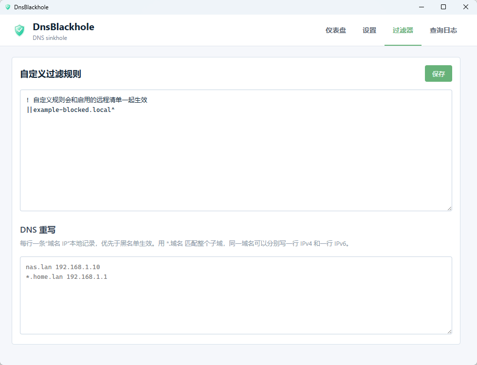
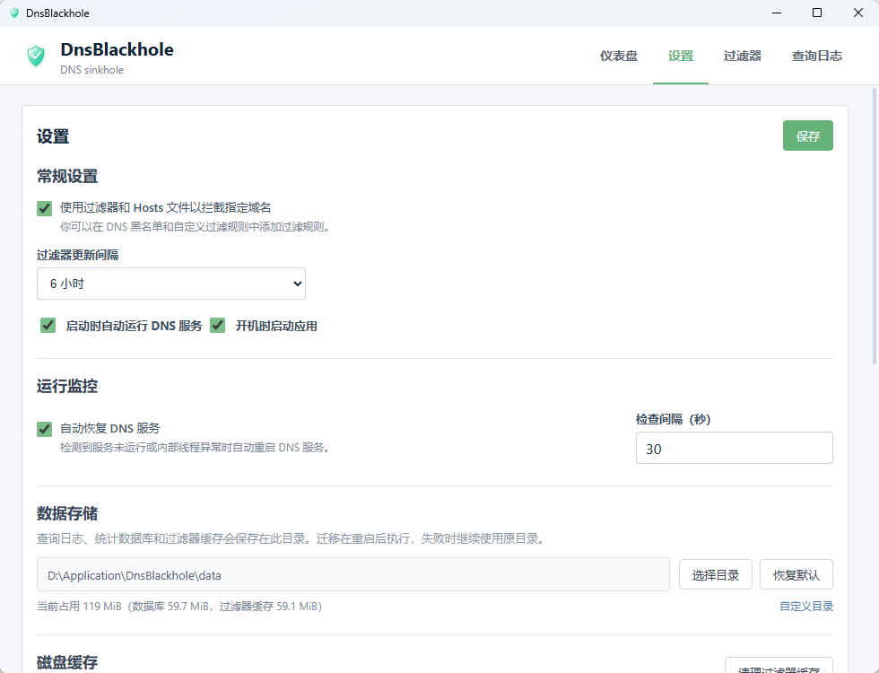

# DnsBlackhole

轻量的本地 DNS 转发与域名拦截工具，使用 Tauri 2、TypeScript 和 Rust 构建。

[下载最新版](https://github.com/wanwan-doudou/DnsBlackhole/releases/latest) · [查看发布记录](https://github.com/wanwan-doudou/DnsBlackhole/releases) · [MIT License](LICENSE)

DnsBlackhole 可以运行在 Windows 或 macOS 主机上，通过远程黑名单、自定义规则和 DNS 重写过滤广告、跟踪及指定域名，同时提供查询日志、统计、客户端访问控制和 DNS 缓存。它是一个带图形界面的本地转发器，不是完整的权威 DNS 或递归解析器。

> 当前 GitHub Release 同时提供 Windows x64 的 NSIS/MSI 安装包和 macOS Universal DMG。

## 界面预览

DnsBlackhole 提供完整的图形界面，可直接查看 DNS 请求趋势、拦截统计、热门域名和客户端活动。

[](image/dashboard.png)

查询日志会展示请求类型、处理结果、命中过滤器、响应时间和客户端信息，便于定位异常请求与验证规则。

[](image/query-log.png)

<details>
<summary>查看更多界面截图</summary>

| DNS 设置 | 安全防护 |
| --- | --- |
| [](image/dns-settings.png) | [](image/security-protection.png) |

| DNS 黑名单 | 自定义规则与 DNS 重写 |
| --- | --- |
| [](image/blocklists.png) | [](image/custom-rules.png) |

### 应用与运行设置

[](image/app-settings.png)

</details>

## 安装

1. 打开 [最新 Release](https://github.com/wanwan-doudou/DnsBlackhole/releases/latest)。
2. Windows 普通用户下载 `DnsBlackhole_<版本>_x64-setup.exe`；需要 MSI 部署时下载 `DnsBlackhole_<版本>_x64_en-US.msi`。
3. macOS 用户下载 `DnsBlackhole_<版本>_universal.dmg`，将应用拖入“应用程序”文件夹；首次启动后，在“设置”中安装后台 DNS 服务，并按系统提示批准后台项目。
4. 启动应用，在“DNS 黑名单”中检查更新，下载已启用的远程清单。
5. 将本机、路由器或局域网设备的 DNS 地址指向运行 DnsBlackhole 的主机。

Windows 版本支持在“设置 → 关于与更新”中检查、下载并安装带签名的新版本。

## 快速开始

默认配置会启动 DNS 服务，并监听：

- IPv4：`0.0.0.0:53`
- IPv6：`[::]:53`

首次使用建议按以下顺序检查：

1. 在“DNS 设置”确认监听地址、上游 DNS、Fallback DNS 和 Bootstrap DNS。
2. 在“安全防护”确认允许客户端网段，不要把递归 DNS 暴露给公网。
3. 在“DNS 黑名单”更新远程清单，按需增删订阅。
4. 使用“自定义过滤规则”添加本地规则，或使用“DNS 重写”配置局域网域名。
5. 启动服务后，在仪表盘和查询日志中确认请求已进入 DnsBlackhole。

如果只服务本机，请将 IPv4 监听地址改为 `127.0.0.1` 并关闭 IPv6 监听。家庭网关场景应保留或进一步收紧默认允许客户端列表，并确认防火墙没有将 `53/udp`、`53/tcp` 暴露到公网。

## 核心能力

### DNS 上游

- 上游、Fallback 上游均支持普通 UDP DNS 和 DoH，每行配置一个服务器。
- 域名形式的 UDP 上游和 DoH 主机名会先通过 Bootstrap DNS 并行查询 A/AAAA，保留多个地址用于故障回退。
- 单个域名上游暂时无法解析不会阻止整个 DNS 服务启动；端点失败后会等待退避时间并重新解析。
- 支持三种请求模式：
  - 负载均衡：每次选择一台上游，失败后尝试其他服务器。
  - 并行请求：同时请求所有上游，采用最先成功的响应。
  - 最快的 IP 地址：收集上游响应并探测结果地址，优先返回可达性更好的结果。

支持的上游格式：

| 类型 | 示例 |
| --- | --- |
| UDP DNS IP | `223.5.5.5` |
| UDP DNS IP 与端口 | `223.5.5.5:53`、`[2400:3200::1]:53` |
| UDP DNS 域名 | `dns.example.com`、`dns.example.com:53` |
| DoH | `https://dns.alidns.com/dns-query` |

Bootstrap DNS 只接受 IP 或 `IP:端口`，不能填写域名或 DoH 地址，避免解析自身时形成依赖循环。

### 过滤与重写

- 默认包含 AdGuard DNS filter、AdAway Default Blocklist 和 AdBlock DNS Filters 三条订阅。
- 可添加、启用、停用、更新和删除远程清单；自动更新失败时采用指数退避，并保留上一版有效缓存。
- 支持本地自定义规则、allowlist、`important`、`badfilter`、DNS 类型限制和 `denyallow`。
- 支持 DNS 重写，格式为 `域名 IP`；`*.example.org` 可匹配子域，优先于黑名单生效。
- 支持零地址、NXDOMAIN、REFUSED 和自定义 IP 四种拦截响应。
- 规则、清单、重写、拦截方式和日志忽略域名保存后热替换，不重启服务、不清空 DNS 缓存。

### 查询、统计与缓存

- 查询日志支持按已处理、已过滤、失败筛选，并可按域名或客户端搜索。
- 拦截详情显示命中规则、来源清单、规则类型、`important` 覆盖和 allowlist 信息。
- 支持客户端名称映射、日志忽略域名、日志保留时间及客户端 IP 匿名化。
- 仪表盘展示查询趋势、拦截率、域名排行、客户端排行、DNS 黑名单排行、上游请求排行和平均响应时间。
- DNS 响应缓存支持容量、最小/最大 TTL、乐观缓存和手动清理。
- 可清理远程过滤器磁盘缓存，不影响配置、查询日志和统计数据库。

### 安全与运行维护

- 允许/拒绝客户端列表支持单个 IP 和 CIDR，拒绝列表优先。
- 默认允许回环、私有 IPv4、ULA IPv6 和链路本地 IPv6 网段。
- 默认每客户端限制为每秒 100 次查询，并拒绝 ANY 查询。
- UDP 访问拒绝和限速请求会静默丢弃；TCP 会尝试返回 `REFUSED`。
- “安全防护”页面展示访问拒绝、限速、UDP 丢弃和 ANY 拒绝统计，并在内存中保留最近 200 条聚合事件；应用重启后事件历史会清空。
- 远程清单和 DoH 默认只允许 HTTPS；HTTP 必须在安全防护中显式开启。
- 单个远程清单默认限制为解压后 50 MB，超限立即中断并保留旧缓存。
- 支持运行状态监控与异常自动恢复、系统托盘、开机启动和关闭窗口后后台运行。

## 默认安全策略

| 项目 | 默认值 |
| --- | --- |
| 监听 | `0.0.0.0:53` 与 `[::]:53` |
| 允许客户端 | `127.0.0.0/8`、`::1/128`、RFC 1918、`fc00::/7`、`fe80::/10` |
| 每客户端限速 | 持续 2000 次/秒，允许约 10 秒短时突发 |
| ANY 查询 | 拒绝 |
| 不安全 HTTP | 禁止 |
| 单个远程清单上限 | 50 MB |
| DNS 缓存 | 启用，16 MB，最小 TTL 60 秒，最大 TTL 24 小时，启用乐观缓存 |
| 查询日志 | 启用，默认保留 90 天 |

这些默认值适合受信任的本机或家庭局域网，但不能替代主机和路由器防火墙。

## 规则语法

当前支持常见 AdGuard Home 规则子集，规则会编译为 exact/suffix 集合以保持查询性能。

| 写法 | 处理方式 |
| --- | --- |
| `||example.org^` | 拦截域名及其子域名 |
| `@@||example.org^` | 放行域名及其子域名，优先级高于普通拦截 |
| `0.0.0.0 example.org`、`127.0.0.1 example.org` | hosts 风格黑名单，仅拦截该域名 |
| `*.example.org` | 拦截域名及其子域名 |
| `example.org` | 仅拦截该域名 |
| `$important` | 提高规则优先级；重要放行规则优先于重要拦截规则 |
| `$badfilter` | 禁用文本和其他修饰符完全匹配的目标规则 |
| `$dnstype=A|AAAA`、`$dnstype=~AAAA` | 按 DNS question 类型包含或排除匹配 |
| `$denyallow=safe.example.org` | 匹配父域时排除指定域名及其子域名 |
| 空行、`#` 注释、`!` 注释 | 忽略并计入注释/空行统计 |
| `/regex/` | 暂不支持，忽略并计入正则统计 |
| 其他未知 `$` 高级修饰符 | 暂不支持，整条忽略并计入高级修饰符统计 |
| 非法域名或包含路径的模式 | 忽略并计入非法域名统计 |

远程清单更新后，界面会显示有效规则数、allowlist 数量、忽略规则数量和忽略原因。

## 协议与当前边界

- 客户端侧支持 UDP DNS 和 TCP DNS；上游支持 UDP DNS 和 HTTP/HTTPS DoH，HTTP 默认禁用。
- 当前不支持 DoT、DoQ，也不执行 DNSSEC 验证。
- DNS 请求必须且只能包含一个 question，暂不支持压缩格式的 question。
- EDNS0/OPT 不在本地规则逻辑中主动解释；上游响应按原始响应转发或缓存。
- 开启 IPv6 双监听时，IPv4 地址由“监听地址”指定，IPv6 地址固定为 `[::]`；当前不能单独选择 `::1` 或指定的内网 IPv6 地址。
- 黑名单命中时，A/AAAA 会按配置生成响应；其他记录类型在零地址或无匹配重写时返回无答案的 NOERROR。

## 测试 DNS

不修改系统 DNS 时，可以直接从本机回环地址测试：

```powershell
nslookup -port=53 example.com 127.0.0.1
nslookup -port=53 example-blocked.local 127.0.0.1
```

安装了 `dig` 时也可以使用：

```bash
dig @127.0.0.1 -p 53 example.com
dig @127.0.0.1 -p 53 example-blocked.local
```

在 Windows 上监听 `53` 端口通常不需要管理员权限。启动失败时，应先检查端口是否被其他 DNS 服务占用、是否被防火墙拦截，以及地址是否被系统保留。macOS/Linux 上监听低端口通常需要管理员权限或对应 capability。Windows 的 `5353` 常被 mDNS 占用，因此不作为默认端口。

## 本地开发

需要 Node.js、pnpm、Rust 工具链以及 Tauri 2 对应的系统构建依赖。

```bash
pnpm install
pnpm tauri:dev
```

开发版使用独立的应用标识和数据目录，并且不会写入系统开机自启项。开机自启请通过安装后的生产版本验证，避免系统登录时启动依赖 Vite 服务的 debug 可执行文件。

生产构建：

```bash
pnpm tauri build
```

低成本验证：

```bash
pnpm build
cargo test --manifest-path src-tauri/Cargo.toml
```

## 发布维护

项目使用 `tauri-plugin-updater` 和 Tauri updater 签名。维护者发布新版本时：

1. 同步更新 `package.json`、`src-tauri/Cargo.toml`、`src-tauri/Cargo.lock` 和 `src-tauri/tauri.conf.json` 中的版本号。
2. 完成前端构建、Rust 测试和 Clippy 检查。
3. 在 Windows 执行 `./scripts/release.ps1`，生成签名的 NSIS、MSI 安装包与 `latest.json`。
4. 推送 `main` 并等待 macOS CI 完成，下载 `DnsBlackhole-macos-universal-release` artifact。
5. 创建一个 `v<版本号>` GitHub Release，统一上传 NSIS、MSI、Windows `latest.json`，以及 macOS artifact 中的 Universal DMG、`.app.tar.gz`、`.sig` 和 `latest-darwin-universal.json`。

更新私钥位于维护者机器的 `%USERPROFILE%\.tauri\dnsblackhole.key`。macOS CI 需要把同一私钥配置为 `TAURI_SIGNING_PRIVATE_KEY` Secret；如果私钥有密码，再配置 `TAURI_SIGNING_PRIVATE_KEY_PASSWORD`。未配置私钥时 CI 仍会生成 DMG，但不会生成自动更新产物。私钥丢失后，旧版本将无法验证后续自动更新，必须妥善离线备份且不得提交到仓库。

## License

本项目采用 [MIT License](LICENSE)。
